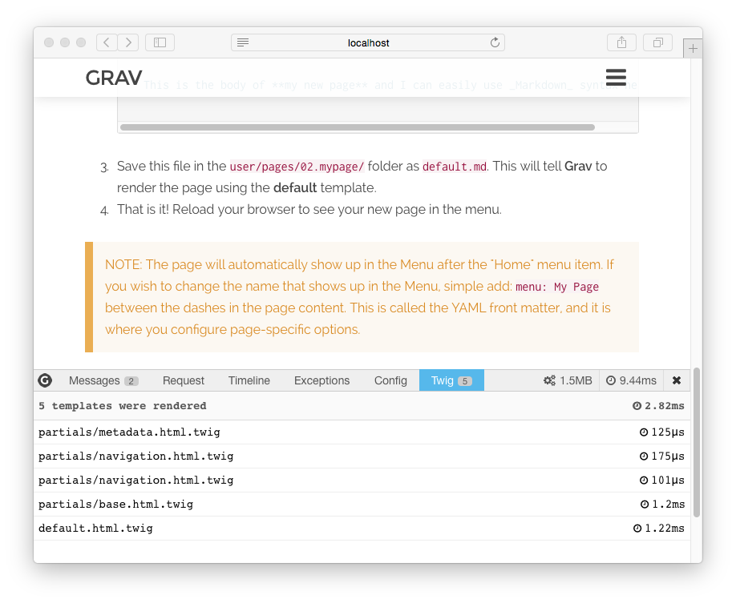

When developing themes and plugins, there is often a need to display **debugging** information. Grav has powerful debugging capabilities via a variety of features:

## PHP Debug Bar

Grav comes with a great tool to make this effort easier called via a **Debug Bar**.  This feature is **disabled** by default, but can be turned on either globally or for your [development environment](../environment-config) only via the `system.yaml` configuration file:

```
debugger:
  enabled: false                       # Enable Grav debugger and following settings
  twig: true                           # Enable debugging of Twig templates
  shutdown:
    close_connection: true             # Close the connection before calling onShutdown(). false for debugging
```


The PHP Debug Bar still provides an overall **processing time** as well as **memory usage**, but it now has several tabs that provide more detailed information.

The first tab is for **messages** and you can use this to help debug your Grav development process by posting information to this tab from your code via `$grav['debugger']->addMessage($my_var)`.  Also you can dump values directly from Twig templates into this panel by using the `{{ dump(my_var) }}` [twig dump function](dump).

Along with **Request**, **Exceptions**, and **Configuration** information, you can also see a detailed breakdown of Grav timing in the **Timeline** panel:


As well as detailed information related to Twig rendering to quickly see which Twig templates are being processed and how long those are taking:



## Error Display

Our new error display page provides detailed information, backtraces and even relevant code block.  This helps to more quickly isolate, identify and resolve critical errors.


For production environments you can disable the detailed error page with something more subtle by configuring the errors options in your `user/config/system.yaml` file:

```
errors:
  display: false
  log: true
```


## Logging

The ability to log information is often useful, and once again, Grav provides us with a simple put powerful logging feature.  Use one of the following syntaxes:

```
$grav['logger']->info('My informational message');
$grav['logger']->notice('My notice message');
$grav['logger']->debug('My debug message');
$grav['logger']->warning('My warning message');
$grav['logger']->error('My error message');
$grav['logger']->critical('My critical message');
$grav['logger']->emergency('Emergency, emergency, there is an emergency here!');

```

All your message will be appended to the `/logs/grav.log` file.


[hook]: ../plugins/event-hooks
[dump]: http://twig.sensiolabs.org/doc/functions/dump.html
