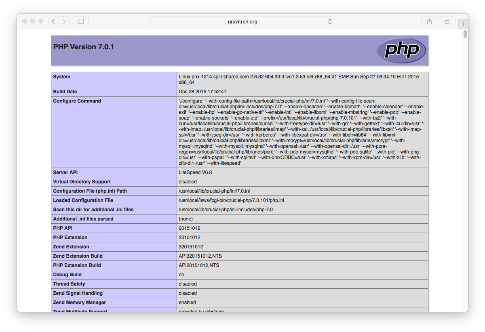




[Crucial Web Hosting](http://www.crucialwebhost.com/promo/1421086/) is another of the new bread of modern web hosting platforms that focuses on both speed and support.  The use of **SSD drives** and **Litespeed** web servers with the latest **Intel XEON processors** ensures that Grav performs fantastically.


In this guide, we will cover the essentials for configuring the **Tier-1 Split-Shared** hosting package to work optimally with Grav.

## Picking your Hosting Plan

[Crucial Web Hosting](http://www.crucialwebhost.com/promo/1421086/) has two primary options when it comes to hosting: **Spit-Shared** and **Split-Dedicated** hosting.  According to Crucial, these cloud-based options are superior to traditional hosting setups as they provide better isolation and performance.

Split-Shared hosting ranges from $10/month to $100/month depending on memory and SSD space.  Split Dedicated ranges from $150/month to $650/month depending on number of cores, memory, SSD space and bandwidth.  We'll just be using the baseline $10/moth option that comes with 256MB of memory and 10GB of SSD space.

## Enabling SSH

First, you will have to open the **Toggle SSH Access** option in the **Security** section of cPanel. On this SSH Access page, you should click the **Enable SSH Access** button.

Then from the **Security Section** again, click the **Manage SSH Keys** option.


There are two options at this point.  **Generate a New Key**, or **Import Key**. It's simpler to create your public/private key pair locally on your computer and then just import the DSA Public Key.

!! Windows users will first need to install [Cygwin](https://www.cygwin.com/) to provide many useful GNU and open source tools that are available on Mac and Linux platforms. When prompted to choose packages, ensure you check the SSH option. After installation, launch the `Cygwin Terminal`

Fire up a terminal window and type:

```
$ ssh-keygen -t dsa
```

This key generation script will prompt you to fill in some values, or you can just hit `[return]` to accept the default values.  This will create an `id_dsa` (private key), and an `id_dsa.pub` (public key) in a folder called `.ssh/` in your home directory. It is important to ensure you **NEVER** give out your private key, nor upload it anywhere, **only your public key**.

Once generate you can paste the contents of your `id_dsa.pub` public key into the `Public Key` field in the **Import SSH key** section of the **SSH Access** page:


After uploading, you should see the key listed at the **Public Keys** section of the Manage SSH Keys page.  You then need to click **Manage** to ensure the key is authorized:


This means you are ready to test ssh'ing to your server.

```
$ ssh crucial_username@crucial_servername
```

Obviously, you will need to put in your Crucial-provided username for `crucial_username`, and the crucial-provided servername for `crucial_servername`.

## Configuring PHP

Currently Crucial Web Hosting defaults to **PHP 5.3** which is not up to the minimum requirements for Grav.  We will have to change the PHP version to something more current.

To do this, we have to add a special handler call in the `.htaccess` file in the web root.  So create the `~/www/.htaccess` file and put the following:

```
AddHandler application/x-httpd-php56 .php
```

Save the file. To test that you have the **correct version of PHP**, you can create a temporary file: `~/www/info.php` and put this in the contents:

```
<?php phpinfo();
```

Save the file and point your browser to this info.php file on your site, and you should be greeted with PHP information reflecting the version you selected earlier:




!! If you are installing Grav at the root of your hosting account, you will need to add the **AddHandler** method to the top of the `.htaccess` file that is provided with Grav

## Setup CLI PHP

At the time of this writing, Crucial's default PHP version is **5.3**.  Because Grav requires PHP **5.5+**, we need to ensure that Grav is using a newer version of PHP on the command line (CLI).  To accomplish this, you should use SSH to access your server and edit your `.bash_profile` file and change the path so that it references the appropriate PHP path before the regular path:

```
# .bash_profile

# Get the aliases and functions
if [ -f ~/.bashrc ]; then
        . ~/.bashrc
fi

# User specific environment and startup programs

PATH=/usr/local/lib/php-5.5/bin:$PATH:$HOME/bin

export PATH
```

You will need _source_ the profile: `$ source ~/.bash_profile` or re-login to your terminal for you path change to take effect, but after doing so you should be able to type `php -v` and see:

```
$ php -v
PHP 5.5.20 (cli) (built: Apr  6 2014 14:43:05)
Copyright (c) 1997-2014 The PHP Group
Zend Engine v2.4.0, Copyright (c) 1998-2014 Zend Technologies
    with the ionCube PHP Loader v4.6.1, Copyright (c) 2002-2014, by ionCube Ltd., and
    with Zend Guard Loader v3.3, Copyright (c) 1998-2013, by Zend Technologies
```

## Install and Test Grav

Using your new found SSH capabilities, let's SSH to your Crucial server (if you are not already there) and download the latest version of Grav, unzip it and test it out!

We will extract Grav into a `/grav` subfolder, but you could unzip directly into the root of your `~/www/` folder to ensure Grav is accessible directly.

```
$ cd ~/www
[~/www]$ wget --no-check-certificate https://github.com/getgrav/grav/releases/download/{{ grav_version }}/grav-v{{ grav_version }}.zip
[~/www]$ unzip grav-v{{ grav_version }}.zip
 ```

You should now be able to point your browser to `http://mycrucialserver.com/grav` using the appropriate URL of course.

Because you have followed these instructions diligently, you will also be able to use the [Grav CLI](../../advanced/grav-cli) and [Grav GPM](../../advanced/grav-gpm) commands such as:

```
$ cd ~/public_html/grav
$ bin/grav clear-cache

Clearing cache

Cleared:  cache/twig/*
Cleared:  cache/doctrine/*
Cleared:  cache/compiled/*
Cleared:  cache/validated-*
Cleared:  images/*
Cleared:  assets/*

Touched: /home/your_user/public_html/grav/user/config/system.yaml
```
